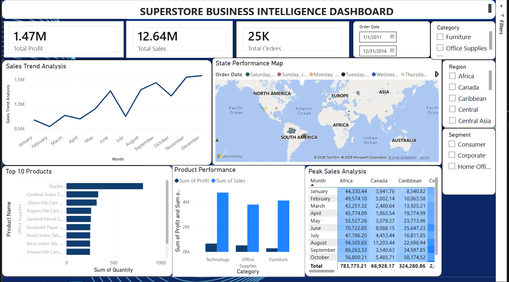

# 🛒 Superstore Data Analysis & Insights Platform

### 👥 Developed by: InfoTact — Group 23

A comprehensive 4-week business intelligence project focused on data engineering, analytical querying, and interactive dashboard architecture for global superstore retail operations.

---

## 📑 Table of Contents

- [Four-Week Engineering Roadmap](#-four-week-engineering-roadmap)
  - [Week 1: Data Collection & Cleaning](#-week-1-data-collection-environment-setup-and-initial-cleaning)
  - [Week 2: Database Design & SQL](#️-week-2-relational-database-design-and-sql-aggregations)
  - [Week 3: Dashboard Architecture](#️-week-3-dashboard-architecture-and-data-visualization)
  - [Week 4: Insights & Reporting](#-week-4-insight-generation-reporting-and-final-submission)
- [Strategic Business Findings](#-strategic-business-findings)
- [Strategic Business Recommendations](#-strategic-business-recommendations)
- [Tools & Technologies](#-tools--technologies)
- [Final Project Dashboards](#️-final-project-dashboards--visualizations)

---

## 📅 Four-Week Engineering Roadmap

### 📊 Week 1: Data Collection, Environment Setup, and Initial Cleaning

- **Infrastructure**: Established the foundational GitHub repository architecture for version control.
- **Data Cleansing**:
  - Identified and handled missing/null values across columns.
  - Extracted and eliminated duplicate transaction records.
  - Standardized date/time formats for reliable time-series modeling.
  - Validated data types to ensure consistent processing.

---

### 🗄️ Week 2: Relational Database Design and SQL Aggregations

- **Database Migration**: Structured and imported the refined dataset into an optimized SQL relational database.
- **Analytical Querying**: Executed complex relational queries utilizing `GROUP BY`, `ORDER BY`, and conditional logic.
- **Metric Aggregations**:
  - Built aggregate functions (`SUM`, `AVG`, `COUNT`) to extract precise financial metrics.
  - Generated performance metrics for total historical revenue.
  - Analyzed best-selling product lines sorted by order volume.
  - Evaluated regional sales distributions to isolate geographic performance.

---

### 🖥️ Week 3: Dashboard Architecture and Data Visualization

- **BI Integration**: Established live data pipeline connections between the analytical dataset and the Business Intelligence environment.
- **UI/UX Visual Design**:
  - Developed dynamic **Line Charts** for identifying chronological and seasonal sales trends.
  - Structured comprehensive **Bar Charts** to isolate underperforming and high-velocity retail products.
  - Configured multi-dimensional **Heatmaps** to visualize hourly traffic surges and transaction frequencies.
- **Interactive Filtering**: Implemented advanced slicers and hierarchical drill-down filters allowing stakeholders to instantly isolate data by distinct month or city location.

---

## 🚀 Week 4: Insight Generation, Reporting, and Final Submission

### 🔍 Strategic Business Findings

- **The Tuesday Surge**: Comprehensive weekly transaction audits reveal that **Tuesdays generate the highest overall revenue and store traffic** compared to any other day of the week.
- **Q4 Seasonal Peak**: Retail demand scales aggressively in the final stretch of the year. The fourth quarter (Q4 — comprising October, November, and December) accounts for a massive **33% of total annual sales volume**.

---

### 💡 Strategic Business Recommendations

- **Targeted Tuesday Campaigns**: Leverage peak weekly traffic by deploying exclusive "Tuesday Flash Sales" or loyalty program accelerators to expand customer lifetime value (LTV).
- **Q4 Inventory Mitigation**: To safeguard against holiday supply chain bottlenecks, baseline inventory stock for high-demand items should be fully replenished prior to October.
- **Off-Peak Engagement**: Introduce automated email marketing triggers with minor discount incentives during off-peak historical time blocks to balance store capacity and optimize operations.

---

## 🛠️ Tools & Technologies

| Tool / Technology | Purpose |
|---|---|
|  | Data cleaning & preprocessing (Week 1) |
|  | DataFrame manipulation & EDA |
|  | Analytical querying & aggregations (Week 2) |
|  | Dashboard design & visualization (Week 3) |
|  | Version control & collaboration |
|  | Interactive data exploration |

---

## 🖼️ Final Project Dashboards & Visualizations

### 📊 Superstore Business Intelligence Dashboard



> **Dashboard Highlights:**
> - 📈 **Total Sales**: 12.64M | **Total Profit**: 1.47M | **Total Orders**: 25K
> - 📉 **Sales Trend Analysis** — Monthly line chart showing seasonal peaks (Q4 surge clearly visible)
> - 🗺️ **State Performance Map** — Global geographic distribution of sales by region
> - 🏆 **Top 10 Products** — Horizontal bar chart ranked by quantity (Staples leads)
> - 📦 **Product Performance** — Category-wise profit vs. sales comparison (Technology, Office Supplies, Furniture)
> - 🔥 **Peak Sales Analysis** — Month × Region heatmap table for granular performance tracking
> - 🎛️ **Interactive Filters** — Slicers for Order Date range, Category, Region, and Customer Segment

---

## 📁 Project Structure

```
Infotact-Team-23-Project-2-Superstore-Analysis/
│
├── data/
│   ├── Superstore.csv                                 # Raw dataset (Global Superstore)
│   └── Cleaned Superstore.csv                         # Cleaned & processed dataset (Week 1 output)
├── Superstore_Data_Cleaning_week1.ipynb               # Week 1: Python data cleaning notebook
├── Superstore_SQL_Analysis_week2.sql                  # Week 2: SQL analytical queries (25 queries)
├── Superstore_Business_Analysis_Dashboard_Week3.pbix  # Week 3: Power BI dashboard
├── screenshots/
│   └── dashboard_overview.png                         # Power BI dashboard screenshot
├── .gitignore                                         # Excludes venv, cache, OS files
└── README.md                                          # Project documentation
```

---

## ▶️ How to Run

### Week 1 — Data Cleaning (Python)
1. Install dependencies: `pip install pandas numpy jupyter`
2. Ensure `data/Superstore.csv` is present in the `data/` folder
3. Open `Superstore_Data_Cleaning_week1.ipynb` in Jupyter Notebook or VS Code
4. Run all cells sequentially — output is saved as `data/Cleaned Superstore.csv`

### Week 2 — SQL Analysis
1. Import `data/Superstore.csv` into a SQL database (MySQL / SQLite recommended) as a table named `Superstore`
2. Open `Superstore_SQL_Analysis_week2.sql`
3. Execute queries individually or as a batch

### Week 3 — Power BI Dashboard
1. Open `Superstore_Business_Analysis_Dashboard_Week3.pbix` in **Power BI Desktop**
2. Refresh the data source connection if prompted
3. Explore dashboards using the built-in slicers and filters

---

*© 2026 InfoTact Group 23 — All rights reserved.*
